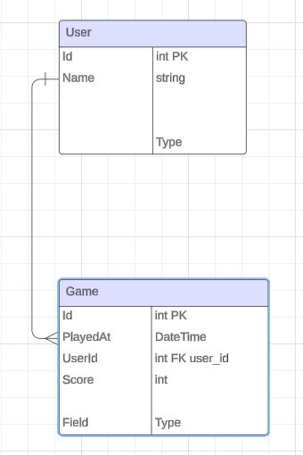

# Who Wants to be a Millionaire

The "Who Wants to Be a Millionaire" Web App aims to recreate the popular TV show's experience in a digital format. It allows users to participate in a quiz game where they can answer multiple-choice questions to progress through different levels of difficulty and win virtual money. This Web App offers an immersive gaming experience, combining frontend interactivity with backend logic and database management. By leveraging modern web development technologies, the application provides users with a seamless and enjoyable quiz game experience.

# Project Requirements
- Application Must build and run
- Unit Testing (70% code coverage for Services and Models layer)
- Utilize an external API
- Backend hosted on Azure Cloud Services

# External API

[Trivia API](https://the-trivia-api.com/docs/v2/)

# User Stories

- Users should be ble to Login
- Users should be able to Logout
- Users should be able to Register
- Users should be able to play a game with new questions each time with increasing difficulty as game progresses
- Users should be able to share their scores/view place in their leaderboard
- Users will have lifelines to help them if they get stuck, similar to the show

# Tables

 

# MVP Goals

- Users should be ble to Login/Logout/Register
- Users should be able to play a game with new questions each time with increasing difficulty as game progresses
- Users should be able to share their scores/view place in their leaderboard
- Users will have allotted time to answer each question
- User should be able to check their profile/change their info

# Stretch goals

- mobile/responsive design
- User adds friends

# Tech stack

- React/JS (Front End)
- C# (Back End Progrmming Language)
- SQL Server (Azure Hosted)
- EF Core (ORM Tech)
- ASP.NET (Web API Framework)
- Npm 
    - react-router-dom
- HTML, CSS
    - Tailwind, DaisyUI

# Responsibilities

- Front End File Structure - Kenan
- Kanban board - Val
- ERD - Whoever does models

# Project Members

- Kenan McKenzie
- Samat Baltin
- Jonathan Cantu
- Virgilio Cabading
