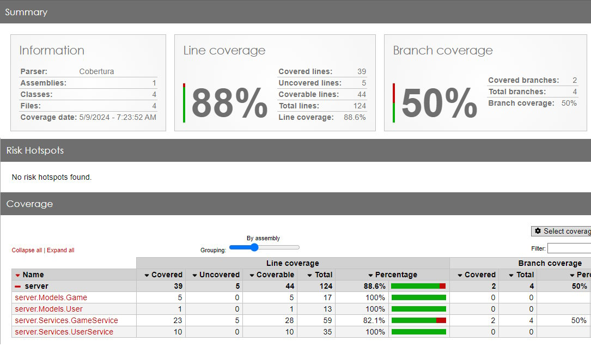

# Who Wants to be a Millionaire Back-End

The "Who Wants to Be a Millionaire" Web App aims to recreate the popular TV show's experience in a digital format. It allows users to participate in a quiz game where they can answer multiple-choice questions to progress through different levels of difficulty and win virtual money. This Web App offers an immersive gaming experience, combining frontend interactivity with backend logic and database management. By leveraging modern web development technologies, the application provides users with a seamless and enjoyable quiz game experience.

# Project Requirements
- Application Must build and run
- Unit Testing (70% code coverage for Services and Models layer)
- Utilize an external API
- Backend hosted on Azure Cloud Services

# Tables

 

 # API

## Deployed to:

https://wwtbam.azurewebsites.net

## User API

- /api/User/register
    - POST mapping
    - [From Body] registerDTO
- /api/User/login
    - POST mapping
    - [From body] loginDTO
- /api/User/logout
    - GET mapping
- /api/User/verify
    - Verify user
    - GET mapping

## Games API

- api/Game
    - Creates a new game
    - POST mapping
    - [From body] game
- api/Game
    - Gets all games
    - GET mapping
- api/Game/{id}
    - Get game by id
    - GET mapping
    - [From Param] id
- api/Game/Highest/{numGames}
    - Retrieves the highest scoring (number of games)
    - GET mapping
    - [From Param] numGames 
- api/Game/{id}
    - Delete game by id
    - DELETE mapping
    - [From Param] id

# Auth

ASP.NET Core Identity

# Test Coverage

# Responsibilities

- Model: Reverse Scaffold / Migration - Kenan / Jonathan / Samat
- User API / authorization - Kenan / Samat
- Game API - Jonathan / Val
- Testing - Full Team
- DevOps - Samat

# Project Members

- Kenan McKenzie
- Samat Baltin
- Jonathan Cantu
- Virgilio Cabading